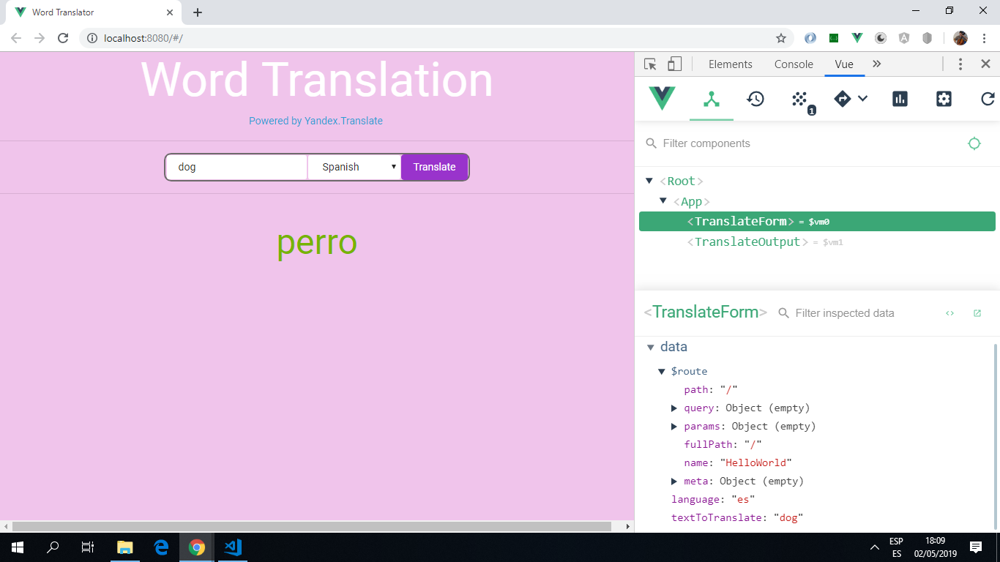

# :zap: Vue App Translator

* Vue2 app to translate a word into a different language using an API.

**Note:** to open web links in a new window use: _ctrl+click on link_

## :page_facing_up: Table of contents

* [:zap: Vue App Translator](#zap-vue-app-translator)
  * [:page_facing_up: Table of contents](#page_facing_up-table-of-contents)
  * [:books: General info](#books-general-info)
  * [:camera: Screenshots](#camera-screenshots)
  * [:signal_strength: Technologies](#signal_strength-technologies)
  * [:floppy_disk: Build Setup](#floppy_disk-build-setup)
  * [:computer: Code Examples](#computer-code-examples)
  * [:cool: Features](#cool-features)
  * [:clipboard: Status & To-Do List](#clipboard-status--to-do-list)
  * [:clap: Inspiration](#clap-inspiration)
  * [:envelope: Contact](#envelope-contact)

## :books: General info

* word translated using `v-on:formSubmit="translateText"`, language selected using `v-model="language"`.

## :camera: Screenshots



## :signal_strength: Technologies

* [Vue framework v2.6.10](https://vuejs.org/) used by adding the vue script to the body of the index.html page.
* [Vue CLI v3.6.3](https://cli.vuejs.org/)
* [Vue Resource v1.5.1](https://www.npmjs.com/package/vue-resource) plugin for making web requests to the Promise-based translation API.
Could have used Axios.
* [Bootswatch v4.3.1](https://bootswatch.com/) Cyborg theme. Link to theme added to index.html
* [Vue DevTools extension for Chrome](https://chrome.google.com/webstore/detail/vuejs-devtools/nhdogjmejiglipccpnnnanhbledajbpd).

## :floppy_disk: Build Setup

``` bash
# install dependencies
npm install

# serve with hot reload at localhost:8080
npm run dev

# build for production with minification
npm run build

# build for production and view the bundle analyzer report
npm run build --report
```

## :computer: Code Examples

* App.vue file: method to get translated word to export.

```javascript

	methods: {
		translateText: function(text, language){
			this.$http.get('https://translate.yandex.net/api/v1.5/tr.json/translate?key=trnsl.1.1.20181104T102320Z.a3fb9954e7544c8c.9b440f44d18ba210605f46825cd17fb833eaf247&lang='+language+'&text='+text)
			.then((response) => {
				this.translatedText = response.body.text[0];
			});
		}
	}

```

## :cool: Features

* Dependency list updated and all conflicts fixed.

## :clipboard: Status & To-Do List

* Status: Not working. Error possible related to Babel and/or webpack. Also Yandex translation API no longer free.
* To-Do: replace.

## :clap: Inspiration

* [Traversy Media Youtube Tutorial: Build a Vue js Translator App Using The Yandex API](https://www.youtube.com/watch?v=DBADrF0C2ls)

## :envelope: Contact

* Repo created by [ABateman](https://www.andrewbateman.org) - you are welcome to [send me a message](https://andrewbateman.org/contact)
